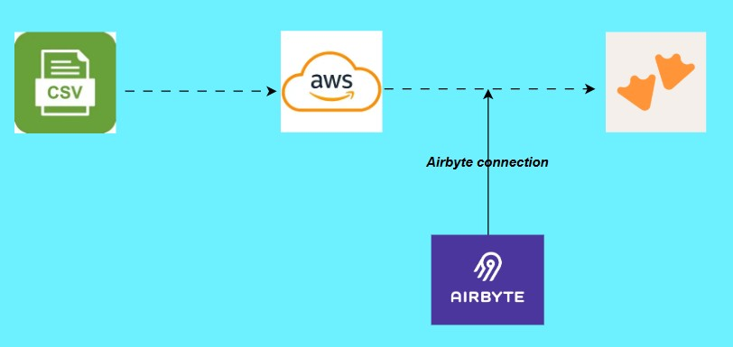

# Retailio Sales Integration Pipeline
## 📌 Project Overview
To stay competitive in modern retail, decisions must be backed by timely, reliable, and well-integrated data. This project delivers a production-ready, cloud-native **ELT data pipeline** capable of handling multiple retail datasets while maintaining accuracy, scalability, and transparency.

---
## 📌 Core Objectives

* **Centralize Data**
  Store all raw datasets (Sales, Customers, Products) in a structured AWS S3 bucket. Build an automated system to move raw CSV files into the cloud data lake.

* **Automate Integration**
  Use Airbyte to extract, load, and sync data seamlessly into the MotherDuck data warehouse.

* **Validate Data Flow**
  Ensure end-to-end data consistency using SQL validation and record count checks.

* **Enable Analytics**
  Prepare clean, query-ready datasets for reporting and business insights.

* **Build Reusability**
  Design a scalable pipeline adaptable to new datasets or regions.

---

## 🧰 Tech Stack

- **Python** – Core programming language for data processing and orchestration 
- **AWS S3** – Cloud storage for raw and processed data
- **Airbyte** – Open-source data integration and ELT tool
- **MotherDuck** – DuckDB-powered cloud data warehouse
- **SQL** - Querying, transformation logic, and data validation across the warehouse
---

## 🚀 Key Features

- Automated data extraction from multiple sources
- Cloud storage on AWS S3 data lake
- Airbyte connects the AWS S3 to MotherDuck data warehouse
- ELT transformations using DuckDB/MotherDuck
- Lightweight, serverless-friendly architecture

---

### 📊 Sample Workflow
Data is loaded, and stored, in **AWS S3** using **Python**.  The data is then loaded into **MotherDuck** warehouse for analytics, orchestrated with via **Airbyte**.

CSV file  → AWS S3 → MotherDuck (SQL) with Airbyte orchestration.


---


## 🛠️ Setup Instructions

1. Clone the repository
2. Configure AWS credentials for S3 access
3. Set up Airbyte locally or on a cloud instance
4. Create a MotherDuck instance and update connection strings
5. Run `pip install -r requirements.txt`
6. Execute the main pipeline script: run `python retailio.py`

---

### 📁 Repository Structure

```
retailio-sales-integration-pipeline/
│
├── data/
│   ├── customers_V2.csv
│   ├── products_V2.csv
│   └── sales_V2.csv
│
├── .env
└── retailio.py
```

---

### 3. AWS Credentials Setup

Create a `.env` file to securely store credentials:

```env
AWS_ACCESS_KEY_ID=your_access_key
AWS_SECRET_ACCESS_KEY=your_secret_key
AWS_REGION=your_region
```

#### Steps to Generate AWS Credentials:

1. Log in to AWS Console.
2. Navigate to **IAM** (Identity and Access Management).
3. Select **Users → Create User**.
4. Attach policy: `AmazonS3FullAccess`.
5. Create user and generate an **Access Key**.
6. Copy and store credentials securely (download CSV if needed).

> ⚠️ Note: Access keys are only visible once.

---

### 4. Upload Data to S3

Write and execute a Python script to upload datasets:

```python
import boto3
import os
from dotenv import load_dotenv

load_dotenv()

s3 = boto3.client(
    's3',
    aws_access_key_id=os.getenv("AWS_ACCESS_KEY_ID"),
    aws_secret_access_key=os.getenv("AWS_SECRET_ACCESS_KEY"),
    region_name=os.getenv("AWS_REGION")
)

bucket_name = "your-bucket-name"

files = {
    "data/customers_V2.csv": "raw/customers/customers.csv",
    "data/products_V2.csv": "raw/products/products.csv",
    "data/sales_V2.csv": "raw/sales/sales.csv"
}

for local_path, s3_path in files.items():
    s3.upload_file(local_path, bucket_name, s3_path)
```

---

### 5. Verify S3 Structure

Ensure files are organized as:

```
s3://your-bucket-name/
└── raw/
    ├── customers/
    ├── products/
    └── sales/
```

---

## 🌊 Data Lake & ELT Concepts

* **Data Lake**: Centralized repository for storing structured and unstructured data. AWS S3 is used as the Data Lake for this pipeline project.
* **ELT vs ETL**:

  * **ETL**: Transform before loading
  * **ELT**: Load first, transform later (used in this project)

---

## ☁️ AWS S3 Bucket Setup

1. Go to AWS Console → Search for **S3**
2. Click **Buckets → Create Bucket**
3. Provide a globally unique name (lowercase)
4. Save and use this bucket in your pipeline

---

## 🔄 Airbyte Configuration

Airbyte is used for data integration from S3 to MotherDuck.

### Steps:

1. Sign in to Airbyte Cloud
2. Add Source → **Amazon S3 (CSV)**

#### Source Configuration:

* **Streams**: folder name (e.g., `customers`)
* **Format**: Parquet
* **Globs**:

  ```
  raw/customers/*.parquet
  ```
* Provide:

  * Access Key
  * Secret Key
  * Region
  * Bucket Name

Repeat for:

* `products`
* `sales`

Test connection before proceeding.

---

## 🏢 MotherDuck Warehouse Setup

### 1. Create Account

Sign up at: https://app.motherduck.com

### 2. Generate Access Token

* Go to **Organization Settings → Access Tokens**
* Create and copy token (only shown once)

---

### 3. Create Database

1. Navigate to **Attached Databases**
2. Click **+ → Create Database**
3. Name your database (e.g., `retailio_database`)
4. Copy connection string

---

### 4. Configure Airbyte Destination

1. Go to Airbyte → Destinations
2. Select **MotherDuck**
3. Enter:

   * Connection string
   * Schema: `main`

Test and confirm connection.

---

## 🔗 Pipeline Execution

1. Connect Source → Destination in Airbyte
2. Select sync mode:

   ```
   Full Refresh | Overwrite
   ```
3. Run sync
4. Verify tables in MotherDuck

---

## ✅ Data Validation

Run SQL queries in MotherDuck to validate integrity:

### Row Count Check

```sql
SELECT COUNT(*) AS total_rows
FROM products;
```

Repeat for:

* `customers`
* `sales`

---

### Null Value Check

```sql
SELECT COUNT(*) AS total_rows
FROM products
WHERE product_id IS NULL;
```

---

### Duplicate Check

```sql
SELECT customer_id, COUNT(*)
FROM customers
GROUP BY customer_id
HAVING COUNT(*) > 1;
```

---

## 📊 Analytics Layer

## Create views for reporting:

A **view** in MotherDuck is a saved SQL query that behaves like a table. It provides a reusable and simplified way to query data without storing it physically.

Views are often referred to as **virtual tables** because:

- They do not store data themselves
- They store query logic only
- Each time the view is queried, the underlying SQL is executed dynamically

### Why Use Views?

Views are an essential component in modern data pipelines for several reasons:

| Benefit | Description |
|---------|-------------|
| **Simplification** | Abstract complex SQL logic into reusable components |
| **Reusability** | Write once, use across dashboards, reports, and transformations |
| **Consistency** | Ensure uniform calculations and business logic |
| **Maintainability** | Centralize logic updates without modifying multiple queries |

### Sales Summary View

```sql
CREATE OR REPLACE VIEW sales_summary AS
SELECT 
    DATE(order_date) AS order_date,
    COUNT(DISTINCT order_id) AS total_orders, 
    SUM(quantity) AS total_quantity, 
    SUM(profit) AS total_profit 
FROM sales 
GROUP BY order_date 
ORDER BY order_date;
```

## 🔍 Querying the View

Once created, the view can be queried like a regular table:

```sql
SELECT * 
FROM sales_summary;
```

---

 Create other views as needed for reporting.

---

## 📈 Performance & Observations

* Efficient ingestion using Airbyte automation
* ELT approach improves scalability and flexibility
* MotherDuck enables fast analytical queries
* S3 provides durable, low-cost storage
* Modular pipeline design allows easy expansion

---

## 📚 Useful Resources

- [AWS S3 Official Documentation](https://docs.aws.amazon.com/s3/)
- [python-dotenv Guide](https://pypi.org/project/python-dotenv/)
- [Airbyte Documentation](https://docs.airbyte.com/developers/api-documentation/)
- [MotherDuck Getting Started](https://motherduck.com/docs/getting-started/)
- [What is a Data Lake?](https://aws.amazon.com/big-data/datalakes-and-analytics/what-is-a-data-lake/)
- [ELT vs ETL Explained](https://www.ibm.com/topics/elt-vs-etl)

---

## 🚀 Future Enhancements

* Add incremental loading
* Implement data quality monitoring
* Introduce orchestration (e.g., Airflow)
* Expand to multi-region datasets
* Add dashboarding (e.g., Power BI, Tableau)

---


## 🤝 Contributing

Contributions are welcome! Please open an issue or submit a pull request.
---

## 🧾 Summary

This project demonstrates how to design and implement a scalable ELT pipeline using AWS S3, Airbyte, and MotherDuck. It ensures reliable data ingestion, validation, and transformation, enabling robust analytics and decision-making.

---
